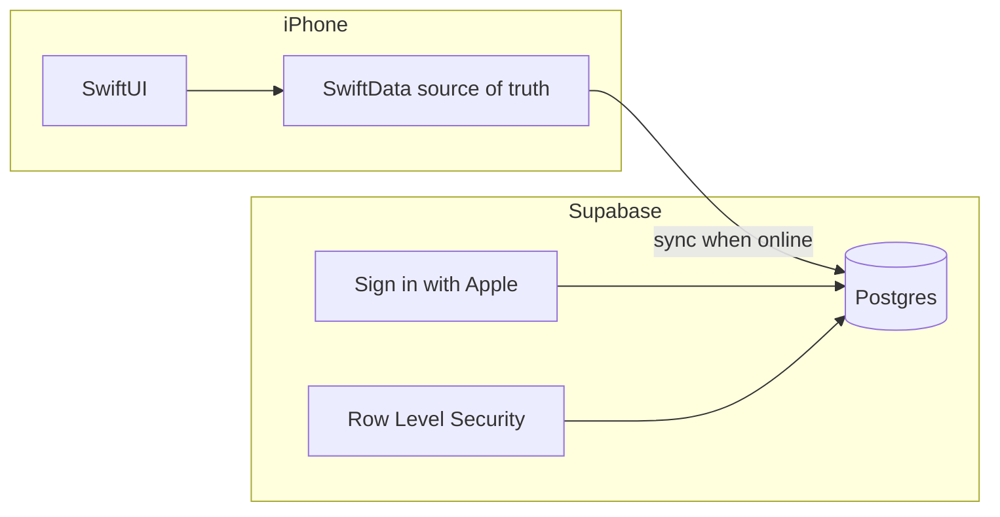
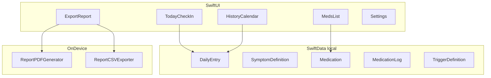

# Symtrace — Product & Technical Plan

**App name:** Symtrace  
**Tagline:** Track symptoms in seconds. Bring a clear timeline to your doctor.  
**Authorship:** Mason Jiang × AI (co-created)  
**Repo:** `/Users/rongrong/github/symtrace/`  
**Platform:** iOS 17+, iPhone first, SwiftUI + SwiftData  

---

## Product roadmap (all versions)

Use this section as the single source of truth for **what ships when**.

### v1 — First version (MVP)

**Goal:** Prove daily logging (&lt;10s) and doctor-ready export. Local-only, no account, no backend.

**Core value:** *Track symptoms in seconds and bring a clear timeline to your doctor.*

| Area | Features |
|------|----------|
| **Logging** | Symptom chips (presets: Headache, Fatigue, Anxiety + unlimited custom via Settings) |
| | Severity slider (1–4); optional collapsed note |
| | No forced categories, tags, or multi-step forms |
| | Optional day rating (bad / ok / good) |
| | Sleep hours on daily entry |
| | Up to **2 active triggers** on Today; more definable in Settings |
| | **Same as yesterday** + **Quick log** (minimal path) |
| | Autosave; offline-first SwiftData |
| **Evolving lists** | Settings: add / rename / reorder / **archive** symptoms & triggers |
| | No hard DB cap; ~5 active symptoms on Today is UX guidance only |
| | Archived items stay in history, calendar, CSV, PDF |
| **Medications** | Med list (name only); daily **Taken / Skipped / —** |
| | Med adherence in PDF/CSV export |
| | **No push reminders** in v1 |
| **History** | Calendar (day coloring); day detail sheet |
| | Trends: frequency + severity (14/30 days, Swift Charts) |
| | Flare-day highlights (rule-based, no prediction copy) |
| **Export** | PDF doctor report + CSV; date range; share sheet |
| | “Questions for my doctor” field before export |
| **Settings** | Symptom & trigger management; med management; full CSV backup |
| | Privacy copy: data stored only on this device |
| **Onboarding** | Skippable (&lt;60s); presets + optional custom symptoms, triggers, med names |
| **Stack** | SwiftUI, SwiftData, PDFKit/CSV on device |
| **Out of scope** | Accounts, Supabase, iCloud sync, HealthKit, patterns AI, caregiver, widgets |

**Success metrics (v1):** median log &lt;10s; ≥4 log days/week by week 3; ≥1 PDF export per active user in 30 days.

---

### v1.1 — Fast follow (after MVP beta)

**Goal:** Retention and convenience without changing core architecture (still local-only).

| Feature | Notes |
|---------|--------|
| Medication **push reminders** | `UNUserNotificationCenter`; times per med; reschedule on edit |
| Notification settings | Permission status; enable/disable per med |
| Home Screen **widget** | Quick log (optional) |
| Trends: **include archived symptoms** toggle | Long-term charts |
| **Show on Today** per symptom | When many active symptoms, user picks visible chips |
| ~~Past-day editor redesign~~ | **Shipped in v1.** `DayDetailView` shows + edits inline; each row opens a focused sheet; swipe-to-remove on logged symptom/trigger rows; sleep can be cleared; footer "Delete this day's entry" with confirmation; `DayDetailSheet`/`EditEntryView` retired. |
| ~~Smart-fill from note~~ | **Shipped in v1.** On-device note parser (no LLM, no network) extracts symptom severity, trigger value, sleep hours, and day rating from free-form notes. Layered matching: direct → fuzzy (Levenshtein) → small medical synonym dictionary → `UITextChecker` spell-correction fallback. Severity comes from explicit digits ("headache 3"), descriptive words (mild/moderate/bad/severe/terrible) with intensifiers ("very", "really"). Every suggestion goes through `SmartFillSheet` for review *before* any write — Apply only persists confirmed rows through `DailyEntryStore`. Surfaced as the "Describe your day" Quick log path (see below); deferred for past-day editing. |
| ~~Quick log redesign~~ | **Shipped in v1.** Today's Quick log section is now a 2×2: row 1 keeps the one-tap shortcuts (Same as yesterday + Feeling fine); row 2 is the new full-width **Describe your day**. Tapping it opens `DescribeYourDaySheet` — a focused full-screen text editor pre-filled with today's note. **Save** persists the typed text as the day's note. **Smart-fill from this note** runs `NoteParser`, opens `SmartFillSheet` for review, and on Apply commits both the typed text (as the note) and confirmed suggestions in one transaction through `DailyEntryStore`. The bottom note section reverts to a plain journal field — Smart-fill is no longer attached to it, eliminating the duplicated entry point. The reframe: with Smart-fill in place, free-form text is a third *logging input method* alongside one-tap shortcuts, not a comment buried at the form's bottom. |

---

### v2 — Insights & device backup (still mostly on-device)

**Goal:** Deeper value from accumulated data; optional Apple backup without running your own server.

| Feature | Notes |
|---------|--------|
| **Pattern insights** | On-device rules first (e.g. sleep &lt;6h → higher fatigue); label as hypotheses |
| **Flare mode** | Simplified UI during flares; optional flare journal |
| **Voice notes** | Optional note on bad days |
| **iCloud backup** | SwiftData + CloudKit — new phone restore; no Supabase required |
| HealthKit import | Sleep/steps (optional, permission-gated) |
| iPad layout | Read-only or simplified logging |
| Apple Watch | Glance + quick severity (optional) |

---

### v3 — Cloud sync & multi-user (Supabase)

**Goal:** Sync across devices and share with care team. **Only build after v1 retention and export usage are validated.**

**Why Supabase (vs only iCloud):**

| Need | iCloud | Supabase |
|------|--------|----------|
| Same user, new iPhone | Yes | Yes |
| **Caregiver read-only on their phone** | No | Yes |
| **Web dashboard** | No | Yes |
| **Android app later** | No | Yes |
| You control sharing / RLS | Limited | Yes |

**Supabase scope (planned):**

| Component | Purpose |
|-----------|---------|
| **Auth** | Sign in with Apple (primary) |
| **Postgres** | Mirror of sync entities: entries, symptom logs, med logs, definitions |
| **Row Level Security** | User owns data; caregiver gets read-only on invited rows |
| **Edge Functions** (optional) | Share-link generation, export email — only if needed |
| **Realtime** (optional) | Caregiver “today” view updates |

**Client architecture (v3):**



- **SwiftData remains source of truth on device** — sync uploads/downloads; app works offline.
- Models already use `UUID` + `updatedAt` for conflict-ready sync.
- **Do not** replace SwiftData with Supabase-only in v3.

**Supabase features (v3 user-facing):**

| Feature | Notes |
|---------|--------|
| Account + sign-in | Optional upgrade from local-only; migrate existing data on first sign-in |
| Multi-device sync | iPhone + iPad (+ future Android) |
| **Caregiver view** | Invite family; read-only: today status, med log, calendar — not full diary unless allowed |
| Share link for clinician | Time-limited read-only URL (optional) |
| Privacy policy update | Data encrypted in transit; hosted region documented |

**Supabase non-goals (even in v3):**

- Cloud AI diagnosis or treatment advice
- Social feed / community
- Selling health data

---

### v4+ — Optional expansion (backlog)

| Feature | Notes |
|---------|--------|
| Food / ingredient tracking | FODMAP, histamine, etc.; large scope — separate module or app |
| LLM summaries | “Visit prep” narrative; requires API + consent |
| Android app | Shares Supabase backend from v3 |
| B2B / clinic portal | Enterprise; different product |

---

## Architecture by version

### v1 (current build target)



- No backend, no Supabase, no auth.

### v1.1 addition

- `NotificationScheduler` → local only (not cloud).

### v3 addition

- Supabase Auth + Postgres sync layer (see roadmap above).

---

## v1 feature scope (detailed)

| Feature | v1 | Later |
|---------|----|-------|
| Log in &lt; 10 seconds | Yes | |
| Tap symptoms + severity + optional note | Yes | |
| No forced categories/tags/forms | Yes | |
| Sleep hours | Yes | |
| Triggers on Today (2 active) | Yes | |
| Settings: evolving symptoms/triggers | Yes | |
| Medication log | Yes | |
| Medication push reminders | | v1.1 |
| Timeline + calendar + trends | Yes | |
| Doctor PDF + CSV | Yes | |
| Automatic patterns | | v2 |
| iCloud backup | | v2 |
| Widget | | v1.1 |
| Supabase / accounts / caregiver | | v3 |
| HealthKit / food / AI | | v2–v4 |

---

## Data model (SwiftData)

Designed for v1 local use and **v3 Supabase sync** (`id`, `updatedAt` on all entities).

| Model | Purpose |
|-------|---------|
| `SymptomDefinition` | `isActive`, `isArchived`, `sortOrder` |
| `TriggerDefinition` | `isActive`, `isArchived` |
| `Medication` | Name, `isArchived`; `reminderTimes` in v1.1 |
| `DailyEntry` | One per calendar day |
| `SymptomLog` | Severity per symptom per day |
| `MedicationLog` | Taken / skipped per med per day |
| `TriggerValue` | Per trigger on daily entry |

**Symptom suggestions (onboarding picker):** Headache, Fatigue, Anxiety (pre-selected) + Pain, Nausea, Brain fog, Insomnia, Dizziness (suggested, unselected). Custom names always available via "Add your own" field.  
**Triggers / medications:** no auto-seed. Discovered in Settings; users add only what they actually want to track.  
**Severity:** 0 = none, 1–4 = mild → severe (single segmented control). Severity 0 means "no log row exists" (see Lazy creation below) — there is no separate "logged as 0" state, which keeps the doctor export honest.  
**Trigger scale:** 0–10 integer (slider, snapped). Same lazy semantics: value 0 = no `TriggerValue` row.  
**Quick actions on Today:**

- *Same as yesterday* — copies day rating, sleep, and any *real* (>0) symptom and trigger values from yesterday's entry; notes are intentionally not copied. Skipped when yesterday has no content.  
- *Feeling fine* — sets day rating = good and **deletes** any existing symptom logs for today (no symptoms = no rows). Sleep and triggers untouched.

### Lazy creation invariant

Nothing materializes until the user actually moves a control:

- Opening the app or navigating to a past day **does not** create a `DailyEntry`. Read paths use `existingTodayEntry()` / `existingEntry(for:)`.
- The shared `EntryForm` holds an optional `DailyEntry` and creates one via `materializeEntry()` only when a binding setter fires.
- `SymptomLog` and `TriggerValue` rows only exist when their value > 0. Setting severity/value back to 0 deletes the row.
- `DailyEntry.hasContent` is the single predicate used by the calendar (gray vs colored), the day-detail sheet (empty state vs detail), and (later) the doctor PDF/CSV filter. This is what guarantees the calendar and detail sheet always agree about whether a day "has data."

---

## Evolving symptoms & triggers

| Limit type | Rule |
|------------|------|
| **Today (UX)** | ~5 active symptoms, 2 active triggers — fast logging |
| **Settings / DB** | No hard cap; archive preserves all historical logs & exports |

See prior rationale: archive beats delete for changing diagnoses.

---

## Screens (v1)

### 1. Onboarding — skippable

- Presets + optional custom symptoms, 0–2 triggers, 0–3 med names (no schedules).

### 2. Today — &lt;10s path

- Symptom chips → severity; day rating; sleep; 2 triggers; collapsed note; Same as yesterday / Quick log.

### 3. Meds — log only

- CRUD names; Taken / Skipped / —; optional collapsed row on Today.

### 4. History

- Calendar + day detail; trends 14/30d; flare highlights.

### 5. Export

- PDF + CSV + share sheet.

### 6. Settings

- Symptoms (active/archived), triggers, meds, CSV backup, privacy.

---

## Implementation phases (v1 only)

| Phase | Week | Deliverables |
|-------|------|----------------|
| 1 Foundation | 1 | Xcode project, models, seed, onboarding, Today + autosave |
| 2 Meds | 2 | Med CRUD + took/skipped (no notifications) |
| 3 History | 3 | Calendar, trends, flare highlights |
| 4 Export | 4 | PDF + CSV, Settings, a11y |
| 5 Beta | 5–6 | TestFlight, metrics |

**Post–v1 beta:** v1.1 reminders → v2 insights/iCloud → v3 Supabase when caregiver/multi-device is required.

---

## App Store (v1)

- Category: Health & Fitness  
- Disclaimer: not medical advice  
- Privacy label: **Data Not Collected** (local-only)

*(v3 with Supabase: update privacy label and policy.)*

---

## Implementation checklist

### v1 — MVP

- [x] Create Xcode project `Symtrace` (SwiftUI + SwiftData, iOS 17+)
- [x] Lock bundle IDs (`com.symtrace.app`, `.app.tests`, `.app.uitests`)
- [ ] **Pending:** Mason's GitHub account → `git init` + per-repo identity + `.gitignore` + first commit
- [x] SwiftData models + preset seed (replace boilerplate `Item.swift`) — Phase 1a, build green on iOS 17.6 simulator
- [x] Today check-in (&lt;10s, autosave) — Phase 1b, build green on iOS 17.6 simulator; lazy creation: no `DailyEntry` / `SymptomLog` / `TriggerValue` is persisted until the user moves a control
- [x] Settings: symptom/trigger/med CRUD + archive — build green on iOS 17.6 simulator (gear icon on Today; reorder, rename, archive/unarchive; CSV backup deferred to Phase 4)
- [x] Onboarding — 2-screen flow (Welcome + symptom picker with 8 chips + custom add); dynamic primary label "Start tracking" / "Skip for now"; gated by `@AppStorage("hasCompletedOnboarding")`; triggers & medications discovered via Settings (deliberate, simpler than 4-step)
- [ ] Meds (log only) — Phase 2
- [~] History: calendar + day detail + past-day edit done (calendar icon on Today; vertical-scroll months newest-first; cell color = max symptom severity that day; unified `DayDetailView` shows + edits inline — every row tappable for a focused single-field sheet, swipe-to-remove on logged symptom/trigger rows, sleep sheet has Clear, footer destructive "Delete this day's entry" with confirmation; `EntryForm` is now Today-only; `DayDetailSheet` and `EditEntryView` retired); trends + flare highlights deferred
- [ ] Export: PDF + CSV
- [ ] TestFlight beta

### v1.1

- [ ] Med reminder times + local notifications
- [ ] Widget quick log (optional)
- [ ] Trends: include archived symptoms

### v2

- [ ] On-device pattern insights
- [ ] iCloud backup (CloudKit)
- [ ] Flare mode + voice notes
- [ ] HealthKit (optional)
- [ ] Add `@Attribute(.unique)` on `DailyEntry.dayKey` paired with a one-shot dedup migration (until then, `HistoryView.entriesByKey` defensively merges duplicates by keeping the latest `updatedAt`)

### v3 — Supabase

- [ ] Supabase project + schema mirroring SwiftData entities
- [ ] Sign in with Apple + RLS policies
- [ ] Sync engine (local-first, conflict resolution)
- [ ] Local → cloud migration on first sign-in
- [ ] Caregiver read-only access
- [ ] Privacy policy + App Store label update

---

## Authorship & credits

Symtrace is **co-created by Mason Jiang and AI**. Mason owns the product direction, design decisions, and shipped code; AI tooling (Cursor / Claude / similar) acts as a collaborator for planning, code generation, and review.

Where this shows up:

| Surface | Credit |
|---------|--------|
| App Store display name | Symtrace |
| App Store subtitle / About page | "Made by Mason × AI" (first name only for privacy) |
| In-app **About / Settings** | "Created by Mason, in collaboration with AI" |
| README | Same framing |
| Bundle Identifier | `com.symtrace.app` (product-tied, no person's name) |
| Source code header (optional) | `// Symtrace — Co-created by Mason × AI.` |

### Privacy choice

Bundle ID is **product-tied** (`com.symtrace.*`), not person-tied. Public credits use **first name only** to avoid permanent indexing of a minor's full name with this app.

### Apple Developer Program note

Apple's developer agreement is signed by an adult.

- **Mason under 18:** Rongrong Ren (parent) enrolls in the Apple Developer Program ($99/yr) on Mason's behalf. The legal **Seller** on the App Store listing is the parent; the **Developer** display name and all user-facing credits remain "Mason × AI".
- **Mason 18+:** Mason enrolls directly.

For local development (simulator + tethered iPhone), no enrollment is needed — Xcode Personal Team is sufficient.

### Git & GitHub setup (deferred)

Git initialization is **paused until Mason has a GitHub account**. Once ready, set up git in this order:

1. Create Mason's GitHub account (age 13+, with parent guidance). Pick a privacy-friendly handle (e.g. `coding-mason`, `mason-builds`) — avoid full last name.
2. In GitHub Settings → Emails, enable **"Keep my email addresses private"** to get a noreply email like `<userID>+<handle>@users.noreply.github.com`.
3. **Per-repo** git config in `/Users/rongrong/github/symtrace/` (does not affect Rongrong's global git):
   ```
   git init
   git config user.name "Mason"
   git config user.email "<userID>+<handle>@users.noreply.github.com"
   ```
4. Add `.gitignore` for Xcode (`.DS_Store`, `xcuserdata/`, `DerivedData/`, `*.xcuserstate`, `build/`).
5. First commit, then add Mason's GitHub as `origin` and push.

**Until then:** continue local development without git. Files are safe on disk; defer history capture until identity is right (changing committed author info later is awkward).

---

## Naming reference

| Use | Name |
|-----|------|
| App Store display | Symtrace |
| Xcode product | Symtrace |
| Repo directory | `symtrace` |
| Organization Identifier | `com.symtrace` |
| Bundle ID (main app) | `com.symtrace.app` ← **locked** |
| Bundle ID (tests) | `com.symtrace.app.tests` |
| Bundle ID (UI tests) | `com.symtrace.app.uitests` |

---

## Xcode project (not created yet)

| Setting | Value |
|---------|--------|
| Product name | `Symtrace` |
| Min iOS | 17.6 |
| Template | App, SwiftUI, SwiftData |

### Repo layout (standard Xcode convention)

The Xcode project lives **inside the existing `symtrace/` repo** — no extra wrapper folder. `Symtrace.xcodeproj` sits next to `plan.md`; `Symtrace/` is just the source folder Xcode requires.

```
symtrace/                  # git repo root
  plan.md
  README.md
  Symtrace.xcodeproj       # project file (at repo root)
  Symtrace/                # app source files (Xcode convention)
    SymtraceApp.swift
    Models/
    Features/
      Today/
      History/
      Meds/
      Export/
      Onboarding/
      Settings/
    Services/
    Components/
    Assets.xcassets
  SymtraceTests/           # unit tests
```

Notes:

- **No `symtrace/Symtrace/Symtrace/` triple nesting.** When creating the project in Xcode, point it at `/Users/rongrong/github/symtrace/` and **uncheck** "Create Git repository" (already a repo) and uncheck the option that wraps the project in another folder, or move the resulting `.xcodeproj` and source folder up one level after creation.
- Docs (`plan.md`, `README.md`) stay at repo root and are not added to the Xcode app target.
- Future siblings (e.g. `supabase/` for v3, `docs/`) sit alongside `Symtrace/` at repo root without disturbing the Xcode layout.
